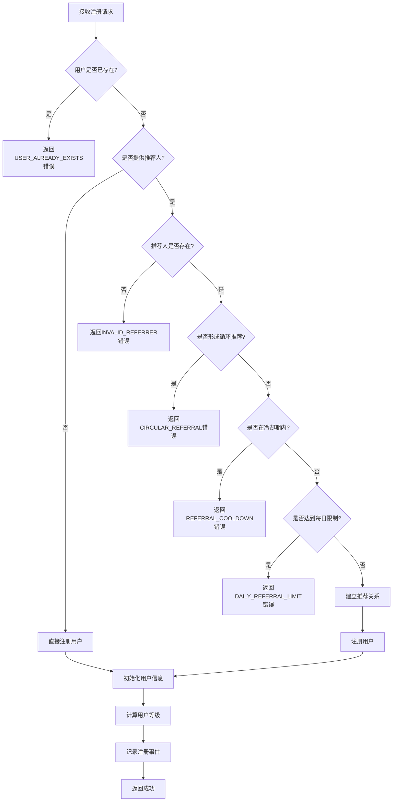
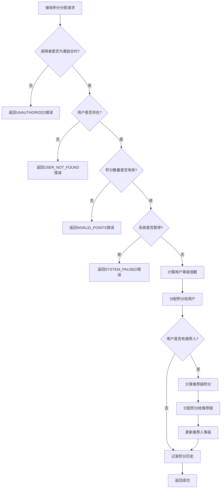

# DD Registry CW 结构化需求规格说明书

## 📋 文档信息

- **项目名称**: DD Registry CW (推荐积分合约)
- **版本**: v1.0
- **文档类型**: 结构化需求规格说明书
- **创建日期**: 2024-01-XX
- **最后更新**: 2024-01-XX

## 🎯 项目概述

DD Registry CW 是一个独立的推荐积分管理合约，专门负责用户推荐关系的建立、维护和积分计算。该合约为激励合约提供积分数据支持，实现推荐系统的核心功能。

## 📊 结构化需求定义

### 1. 用户管理功能

#### 1.1 用户注册 (Register)

```json
{
  "function_name": "register",
  "description": "注册新用户并建立推荐关系",
  "business_rules": {
    "prerequisite": [
      "用户地址必须有效",
      "用户不能重复注册",
      "推荐人地址必须已注册（如果提供）",
      "不能形成循环推荐关系"
    ],
    "postcondition": [
      "用户信息被保存",
      "推荐关系被建立",
      "用户等级被初始化",
      "记录注册事件日志"
    ],
    "constraints": {
      "max_referral_depth": 3,
      "referral_cooldown": 3600,
      "max_daily_referrals": 10
    }
  },
  "input_schema": {
    "type": "object",
    "properties": {
      "referrer": {
        "type": "string",
        "pattern": "^luckee[a-z0-9]{38}$",
        "description": "推荐人地址（可选）",
        "nullable": true
      }
    },
    "required": []
  },
  "output_schema": {
    "type": "object",
    "properties": {
      "success": {"type": "boolean"},
      "user_address": {"type": "string"},
      "referrer": {"type": "string", "nullable": true},
      "user_level": {"type": "string"},
      "registered_at": {"type": "integer"}
    }
  },
  "error_codes": {
    "USER_ALREADY_EXISTS": "用户已存在",
    "INVALID_REFERRER": "无效的推荐人地址",
    "CIRCULAR_REFERRAL": "检测到循环推荐",
    "REFERRAL_COOLDOWN": "推荐冷却期未结束",
    "DAILY_REFERRAL_LIMIT": "达到每日推荐限制"
  }
}
```

#### 1.2 推荐关系验证 (ValidateReferral)

```json
{
  "function_name": "validate_referral",
  "description": "验证推荐关系的有效性",
  "business_rules": {
    "prerequisite": [
      "用户地址必须有效",
      "推荐人地址必须有效"
    ],
    "postcondition": [
      "返回验证结果",
      "记录验证事件"
    ],
    "constraints": {
      "max_depth_check": 3,
      "circular_check": true
    }
  },
  "input_schema": {
    "type": "object",
    "properties": {
      "user": {
        "type": "string",
        "pattern": "^luckee[a-z0-9]{38}$",
        "description": "用户地址"
      },
      "referrer": {
        "type": "string",
        "pattern": "^luckee[a-z0-9]{38}$",
        "description": "推荐人地址"
      }
    },
    "required": ["user", "referrer"]
  },
  "output_schema": {
    "type": "object",
    "properties": {
      "valid": {"type": "boolean"},
      "reason": {"type": "string", "nullable": true},
      "referral_depth": {"type": "integer"}
    }
  }
}
```

### 2. 积分管理功能

#### 2.1 积分分配 (AllocateRewards)

```json
{
  "function_name": "allocate_rewards",
  "description": "分配积分给用户及其推荐链",
  "business_rules": {
    "prerequisite": [
      "调用者必须是激励合约",
      "用户必须已注册",
      "积分数量必须大于0",
      "系统未处于紧急暂停状态"
    ],
    "postcondition": [
      "用户积分增加",
      "推荐链积分按比例分配",
      "积分历史被记录",
      "用户等级可能更新"
    ],
    "constraints": {
      "max_points_per_allocation": "1000000000000000",
      "referral_rates": {
        "direct": "0.5",
        "level_2": "0.2", 
        "level_3": "0.1"
      },
      "level_multipliers": {
        "Bronze": "1.0",
        "Silver": "1.2",
        "Gold": "1.5",
        "Platinum": "2.0"
      }
    }
  },
  "input_schema": {
    "type": "object",
    "properties": {
      "user": {
        "type": "string",
        "pattern": "^luckee[a-z0-9]{38}$",
        "description": "用户地址"
      },
      "points": {
        "type": "string",
        "pattern": "^[0-9]+$",
        "minimum": "1",
        "description": "积分数量"
      },
      "reason": {
        "type": "string",
        "enum": ["activity_bonus", "referral_reward", "level_bonus", "special_event"],
        "description": "积分原因"
      },
      "related_user": {
        "type": "string",
        "pattern": "^luckee[a-z0-9]{38}$",
        "description": "相关用户地址（可选）",
        "nullable": true
      },
      "event_id": {
        "type": "string",
        "description": "事件ID（可选）",
        "nullable": true
      }
    },
    "required": ["user", "points", "reason"]
  },
  "output_schema": {
    "type": "object",
    "properties": {
      "success": {"type": "boolean"},
      "allocated_points": {"type": "string"},
      "referral_chain": {
        "type": "array",
        "items": {
          "type": "object",
          "properties": {
            "user": {"type": "string"},
            "points": {"type": "string"},
            "level": {"type": "integer"}
          }
        }
      }
    }
  },
  "error_codes": {
    "UNAUTHORIZED": "调用者无权限",
    "USER_NOT_FOUND": "用户不存在",
    "INVALID_POINTS": "无效的积分数量",
    "SYSTEM_PAUSED": "系统已暂停",
    "ALLOCATION_FAILED": "积分分配失败"
  }
}
```

#### 2.2 积分提取 (WithdrawPoints)

```json
{
  "function_name": "withdraw_points",
  "description": "用户提取累积的积分",
  "business_rules": {
    "prerequisite": [
      "用户必须已注册",
      "用户必须有足够的积分",
      "提取数量必须大于最小提取限制",
      "系统未处于紧急暂停状态"
    ],
    "postcondition": [
      "用户积分减少",
      "提取记录被保存",
      "通知激励合约铸造代币"
    ],
    "constraints": {
      "min_withdrawal_amount": "1000",
      "max_withdrawal_per_day": "1000000000000000",
      "withdrawal_cooldown": 3600
    }
  },
  "input_schema": {
    "type": "object",
    "properties": {
      "amount": {
        "type": "string",
        "pattern": "^[0-9]+$",
        "minimum": "1000",
        "description": "提取的积分数量"
      }
    },
    "required": ["amount"]
  },
  "output_schema": {
    "type": "object",
    "properties": {
      "success": {"type": "boolean"},
      "withdrawn_amount": {"type": "string"},
      "remaining_points": {"type": "string"},
      "transaction_id": {"type": "string"}
    }
  },
  "error_codes": {
    "INSUFFICIENT_POINTS": "积分不足",
    "BELOW_MIN_WITHDRAWAL": "低于最小提取限制",
    "WITHDRAWAL_COOLDOWN": "提取冷却期未结束",
    "DAILY_LIMIT_EXCEEDED": "超过每日提取限制"
  }
}
```

### 3. 查询功能

#### 3.1 用户信息查询 (GetUserInfo)

```json
{
  "function_name": "get_user_info",
  "description": "查询用户详细信息",
  "business_rules": {
    "prerequisite": [
      "用户地址必须有效",
      "用户必须已注册"
    ],
    "postcondition": [
      "返回用户完整信息"
    ]
  },
  "input_schema": {
    "type": "object",
    "properties": {
      "user": {
        "type": "string",
        "pattern": "^luckee[a-z0-9]{38}$",
        "description": "用户地址"
      }
    },
    "required": ["user"]
  },
  "output_schema": {
    "type": "object",
    "properties": {
      "user_info": {
        "type": "object",
        "properties": {
          "recommender": {"type": "string", "nullable": true},
          "direct_referrals": {
            "type": "array",
            "items": {"type": "string"}
          },
          "reward_points": {"type": "string"},
          "registered_at": {"type": "integer"},
          "last_active_at": {"type": "integer"},
          "user_level": {"type": "string"},
          "referral_stats": {
            "type": "object",
            "properties": {
              "total_referrals": {"type": "integer"},
              "active_referrals": {"type": "integer"},
              "total_points_earned": {"type": "string"}
            }
          },
          "status": {"type": "string"}
        }
      }
    }
  }
}
```

#### 3.2 推荐链查询 (GetReferralChain)

```json
{
  "function_name": "get_referral_chain",
  "description": "查询用户的推荐关系链",
  "business_rules": {
    "prerequisite": [
      "用户地址必须有效",
      "用户必须已注册"
    ],
    "postcondition": [
      "返回完整的推荐链"
    ],
    "constraints": {
      "max_depth": 3,
      "max_nodes": 1000
    }
  },
  "input_schema": {
    "type": "object",
    "properties": {
      "user": {
        "type": "string",
        "pattern": "^luckee[a-z0-9]{38}$",
        "description": "用户地址"
      },
      "max_depth": {
        "type": "integer",
        "minimum": 1,
        "maximum": 3,
        "description": "最大查询深度",
        "default": 3
      }
    },
    "required": ["user"]
  },
  "output_schema": {
    "type": "object",
    "properties": {
      "referral_chain": {
        "type": "array",
        "items": {
          "type": "object",
          "properties": {
            "user": {"type": "string"},
            "level": {"type": "integer"},
            "points": {"type": "string"},
            "user_level": {"type": "string"},
            "referral_count": {"type": "integer"}
          }
        }
      },
      "total_depth": {"type": "integer"},
      "total_nodes": {"type": "integer"}
    }
  }
}
```

#### 3.3 积分排行榜 (GetPointsLeaderboard)

```json
{
  "function_name": "get_points_leaderboard",
  "description": "查询积分排行榜",
  "business_rules": {
    "prerequisite": [
      "系统正常运行"
    ],
    "postcondition": [
      "返回排行榜数据"
    ],
    "constraints": {
      "max_limit": 100,
      "default_limit": 10
    }
  },
  "input_schema": {
    "type": "object",
    "properties": {
      "limit": {
        "type": "integer",
        "minimum": 1,
        "maximum": 100,
        "description": "返回数量限制",
        "default": 10
      },
      "offset": {
        "type": "integer",
        "minimum": 0,
        "description": "偏移量",
        "default": 0
      }
    },
    "required": []
  },
  "output_schema": {
    "type": "object",
    "properties": {
      "leaderboard": {
        "type": "array",
        "items": {
          "type": "object",
          "properties": {
            "rank": {"type": "integer"},
            "user": {"type": "string"},
            "points": {"type": "string"},
            "user_level": {"type": "string"},
            "referral_count": {"type": "integer"}
          }
        }
      },
      "total_users": {"type": "integer"},
      "user_rank": {"type": "integer", "nullable": true}
    }
  }
}
```

### 4. 用户等级系统

#### 4.1 等级定义

```json
{
  "user_levels": {
    "Bronze": {
      "min_referrals": 0,
      "max_referrals": 9,
      "multiplier": "1.0",
      "description": "青铜等级"
    },
    "Silver": {
      "min_referrals": 10,
      "max_referrals": 49,
      "multiplier": "1.2",
      "description": "白银等级"
    },
    "Gold": {
      "min_referrals": 50,
      "max_referrals": 99,
      "multiplier": "1.5",
      "description": "黄金等级"
    },
    "Platinum": {
      "min_referrals": 100,
      "max_referrals": 999999,
      "multiplier": "2.0",
      "description": "铂金等级"
    }
  }
}
```

#### 4.2 等级计算规则

```json
{
  "level_calculation": {
    "trigger_conditions": [
      "用户注册时",
      "推荐关系建立时",
      "积分分配时"
    ],
    "calculation_method": "基于直接推荐数量",
    "update_frequency": "实时",
    "level_benefits": {
      "point_multiplier": "积分倍数",
      "referral_bonus": "推荐奖励",
      "special_privileges": "特殊权限"
    }
  }
}
```

### 5. 积分规则配置

#### 5.1 推荐奖励比例

```json
{
  "referral_reward_rates": {
    "direct_referral": {
      "rate": "0.5",
      "description": "直接推荐奖励比例50%"
    },
    "level_2_referral": {
      "rate": "0.2",
      "description": "二级推荐奖励比例20%"
    },
    "level_3_referral": {
      "rate": "0.1",
      "description": "三级推荐奖励比例10%"
    },
    "total_distribution": {
      "rate": "0.8",
      "description": "总分配比例80%，剩余20%为系统保留"
    }
  }
}
```

#### 5.2 积分衰减规则

```json
{
  "points_decay_rules": {
    "decay_period": 30,
    "decay_rate": "0.01",
    "decay_unit": "days",
    "description": "每30天衰减1%",
    "exemptions": [
      "新获得的积分（30天内）",
      "已提取的积分",
      "特殊活动积分"
    ]
  }
}
```

### 6. 安全机制

#### 6.1 防循环推荐

```json
{
  "circular_referral_prevention": {
    "detection_method": "深度优先搜索",
    "max_depth": 3,
    "validation_points": [
      "用户注册时",
      "推荐关系建立时",
      "积分分配时"
    ],
    "error_handling": "拒绝操作并返回错误"
  }
}
```

#### 6.2 权限控制

```json
{
  "permission_control": {
    "admin_functions": {
      "allowed_callers": ["contract_owner"],
      "functions": [
        "update_config",
        "emergency_pause",
        "update_points_rules"
      ]
    },
    "incentive_functions": {
      "allowed_callers": ["incentive_contract"],
      "functions": [
        "allocate_rewards",
        "query_user_points",
        "query_referral_chain"
      ]
    },
    "user_functions": {
      "allowed_callers": ["registered_users"],
      "functions": [
        "register",
        "withdraw_points",
        "query_own_info"
      ]
    }
  }
}
```

### 7. 业务规则决策树

#### 7.1 用户注册决策树



#### 7.2 积分分配决策树



### 8. 边界条件

#### 8.1 数值边界

```json
{
  "boundary_conditions": {
    "points_limits": {
      "min_points": "1",
      "max_points_per_allocation": "1000000000000000",
      "max_total_points": "1000000000000000000"
    },
    "user_limits": {
      "max_users": 1000000,
      "max_referrals_per_user": 10000,
      "max_referral_depth": 3
    },
    "time_limits": {
      "min_cooldown": 3600,
      "max_cooldown": 86400,
      "decay_period": 30
    }
  }
}
```

#### 8.2 异常处理

```json
{
  "exception_handling": {
    "overflow_protection": {
      "description": "防止积分溢出",
      "implementation": "使用Uint128类型，检查运算结果"
    },
    "underflow_protection": {
      "description": "防止积分下溢",
      "implementation": "检查积分是否足够"
    },
    "reentrancy_protection": {
      "description": "防止重入攻击",
      "implementation": "状态更新优先于外部调用"
    },
    "circular_referral_protection": {
      "description": "防止循环推荐",
      "implementation": "深度优先搜索检测循环"
    }
  }
}
```

## 📝 变更记录

| 版本 | 日期 | 变更内容 | 变更人 |
|------|------|----------|--------|
| v1.0 | 2024-01-XX | 初始版本创建 | AI Assistant |

---

**注意**: 本文档是AI生成代码和测试用例的直接输入，包含所有业务逻辑的决策树和边界条件。任何功能变更都必须同步更新本文档。
